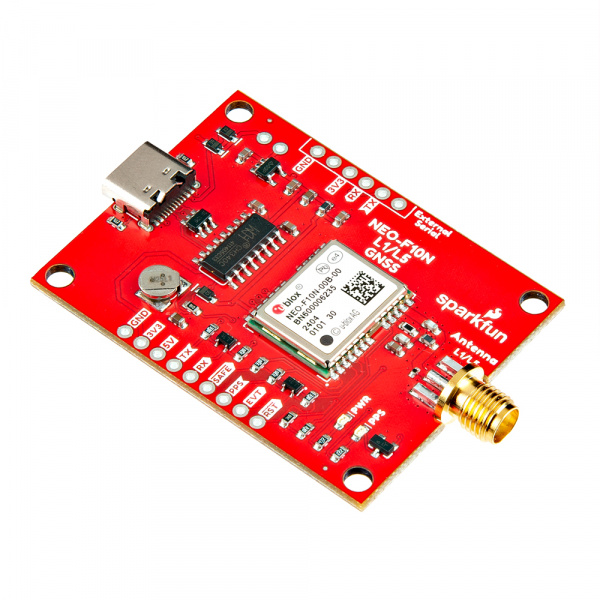
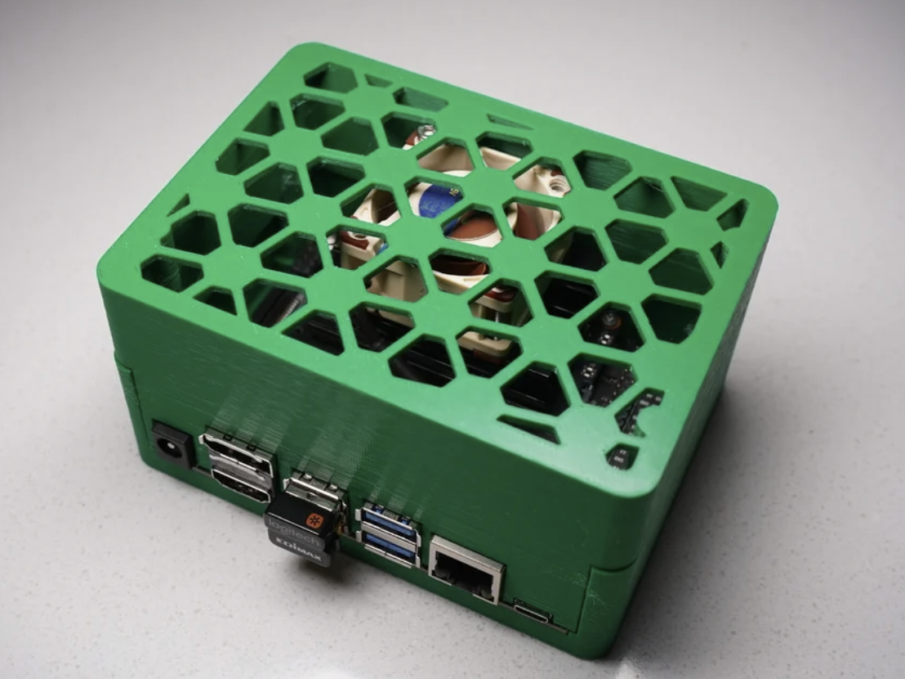
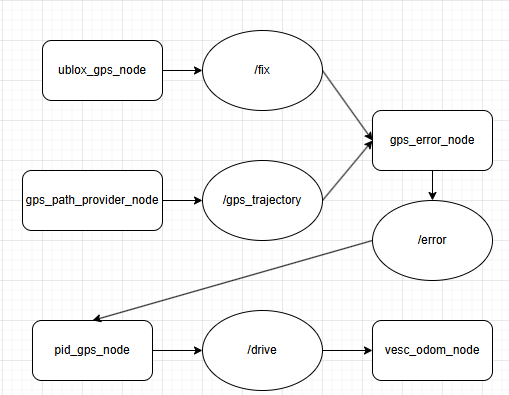
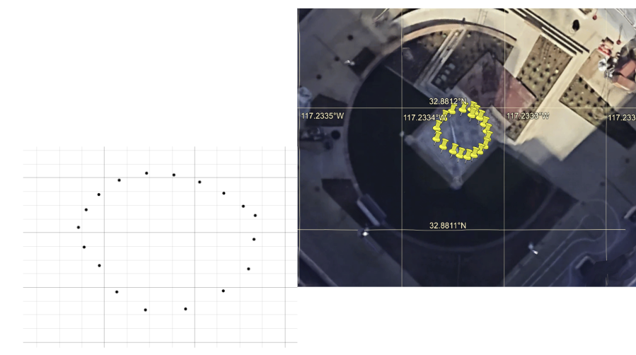

# UCSD ECEMAE148 Team2 FinalProject




<div>
<h3>This is the github repo for Team2, we mainly focused on recovering Ublox GPS in ROS2. </h3>
<body>
  <p>
  In the original github repository from <a href="https://gitlab.com/ucsd_robocar2/ucsd_robocar_hub2">ucsd_robocar_hub2</a>, but it dosen't have the functionality of running gps inside the docker container(ROS2). Therefore, we implemented the node for ublox gps from scratch to work with the existing files for the robot to follow gps coordinates. It would be useful for future classes.
  </p>
  
</body>


<div id="top"></div>

<h1 align="center">Pedestrian Avoidence Robot Car</h1>
<h4 align="center"></h4>
<!-- PROJECT LOGO -->:
<br />
<div align="center">

<h3>ECEMAE148 Final Project</h3>
<p>
Team 2 Winter 2025
</p>

<!--  -->
</div>


<!-- TABLE OF CONTENTS -->
<details>
  <summary>Table of Contents</summary>
  <ol>
    <li><a href="#team-members">Team Members</a></li>
    <li><a href="#final-project">Final Project</a></li>
      <ul>
        <li><a href="#original-goals">Original Goals</a></li>
          <ul>
            <li><a href="#goals-we-met">Goals We Met</a></li>
            <li><a href="#our-hopes-and-dreams">Our Hopes and Dreams</a></li>
              <ul>
                <li><a href="#stretch-goal-1">Stretch Goal 1</a></li>
                <li><a href="#stretch-goal-2">Stretch Goal 2</a></li>
              </ul>
          </ul>
        <li><a href="#final-project-documentation">Final Project Documentation</a></li>
      </ul>
    <li><a href="#robot-design">Robot Design </a></li>
      <ul>
        <li><a href="#cad-parts">CAD Parts</a></li>
          <ul>
            <li><a href="#final-assembly">Final Assembly</a></li>
            <li><a href="#custom-designed-parts">Custom Designed Parts</a></li>
            <li><a href="#open-source-parts">Open Source Parts</a></li>
          </ul>
        <li><a href="#electronic-hardware">Electronic Hardware</a></li>
          <ul>
            <li><a href="#embedded-systems">Embedded Systems</a></li>
            <li><a href="#ros2">ROS2</a></li>
            <li><a href="#donkeycar-ai">DonkeyCar AI</a></li>
          </ul>
      </ul>
    <li><a href="#acknowledgments">Acknowledgments</a></li>
    <li><a href="#authors">Authors</a></li>
    <li><a href="#contact">Contact</a></li>
  </ol>
</details>


<!-- TEAM MEMBERS -->
## Team Members

<div align="center">
    <p align = "center">Andrew N, Daphne, Jose, and Rodolfo</p>
</div>

<h4>Team Member Major and Class </h4>
<ul>
  <li>Andrew N - Electrical Engineering, Curcuits and Systems - Class of 2026</li>
  <li>Daphne - Electrical Engineering, Curcuits and Systems - Class of 2026</li>
  <li>Jose - Biology Engineering </li>
  <li>Rodolfo - Mechanical Engineering</li>
</ul>

<!-- Final Project -->
## Final Project
<!-- put stuff here -->

<!-- Original Goals -->
### Original Goals
Originally, we proposed to create a robot that can follow the gps lap while avoid pedestrian and remappng in real time. We also promised to use ROS2, Oakd-lite camera, ublox gps, and jetson nano(all the tools we already had since the begining of the quarter). To do so, we need to run the camera detection of pedestrian in ROS2 and find a way to send message to the gps and modify the path if needed, based on the detection.
<!--Originally, we envisioned a chatgpt robot in a classroom that students could command to do tasks. Our goalpost task was "go to the whiteboard and help the student solve the problem." This would require chatgpt to navigate a room, create a path to a whiteboard, solve visual math problems by identifying text on a board, and provide its usefulness to a student through good help. -->
   
<!-- End Results -->
### Goals We Met
<p>
  The gps was setup inside the donkey environment, which is outside of ROS2(docker container). We struggled to make ROS2 communicate with the gps outside of the docker environment especially doing rerouting of the gps lap when a pedestrian is detected. Therefore, we decidced to make gps works inside ROS2 instead of in the donkey environment, and this has become our top priority since it would be a lot easier to use for the future classes. To do so, we figured the general workflow of the packages and nodes provided inside docker contianer, and we ended up pulling the original github repository from <a href="https://gitlab.com/ucsd_robocar2/ucsd_robocar_hub2">ucsd_robocar_hub2</a> to get necessary nodes. We found that it was missing the node of reading from gps, so we implemented the node for ublox gps from scratch called "ublox_gps_node.py" under the directory ucsd_robocar_hub2/ucsd_robocar_sensor2_pkg/ucsd_robocar_sensor2_pkg/. We did a series of testing of the gps node to work with the existing files for the robot to follow gps coordinates. The overall workflow detail will be discussed in the Final Project Documentation sectoion.
</p>

<p>
  On the camera side, we self trained a model on roboflow to detect pedestrian by detecting any "foot" appearing in front of the oakd camera. This would be easier for camera to see if there is any people right in front of the camera instead of looking from a long distance to record a whole person. We created a package in ROS2 for the camera called "oakd_node.py" under ucsd_robocar_hub2/oakd_ros2/oakd_ros2/ to send detection message of "left", "right", or "none" to indicate which direction the pedestrian is moving, so the robocar can change its route accordingly.
</p>
<p>
  At the end, we didn't show the completed demo of robot car avoiding pedestrian while following the lap, but we have every parts(camera and gps) completed separately.
</p>
<!--We were succesfully able to communicate with the robot. We can ask chatgpt what it saw around it. Often chatgpt went into multiple paragraphs. One test we did was telling chat gpt to drive towards the hand with more fingers up. We held out our hand with 2 fingers to the left, and 4 fingers to the right. Chatgpt sent a drive command to turn towards the right. We also were able to generate decent paths with chatgpt; at one point we asked it to make a heart path and it followed the path pretty well. We feel that large language models open up many emergent capabilities for robots, and that our overall project of giving chatgpt a level of autonomy was a success. We feel that if we ran our original test, that chatgpt would do decently well, except for navigating around tables. Often times durring the debugging process we would just ask chatgpt what data it had. For example, when debugging lidar, we would ask it what it thought of the data format, what could be improved, and what reference data it wanted from the user. All in all, its linguistic capabilities were superb. -->

### Future Goals
#### Stretch Goal 1
Unfortunately we couldn't finish combining every part together for the robot car to avoid pedestrian while following the GPS path as we promised originally, but we have the GPS node and camera node completed in ROS2, we just need to make some changes to "gps_path_provider_node.py" under ucsd_robocar_hub2/ucsd_robocar_path2_pkg/ucsd_robocar_path2_pkg
/ to activate conditions of path change based on the "oakd_node.py" which publishes the detection data. We will put the possible changes of the file inside the folder /possible_implementation to achieve that.

<!-- We want to have chatgpt's path following trigger the manage.py drive command automatically so that chatgpt can navigate fully autonomous. We also want to have chatgpt only use one model instead of two seperated models. Finally, we want to turn the lidar data into a SLAM map and feed chatgpt an image map of its surroundings to generate better maps. -->

#### Stretch Goal 2
We would like to implement self parking using lidar and computer vision so the robot car can correct itself based on the space lines using the camera.
<!--We want automatic lidar stopping to be implemented for safety. Since chatgpt does not control the robot in real time, we need a way for the robot to stop if it is about to hit an object or person.-->

## Final Project Documentation

<!-- Early Quarter -->
### Robot Design CAD
<!---->

#### Open Source Parts
| Part | CAD Model | Source |
|------|--------|-----------|
| Jetson Nano Case |  | [Thingiverse](https://www.thingiverse.com/thing:3532828) |

### Software

#### Embedded Systems
The system is running based on jetson nano and oakd-lite camera. 
<!--To run the system, we used a Jetson Nano with an Oakd depth camera, an ld06 lidar sensor, and a point one Fusion Engine gps. For motion we used a VESC Driver within the Donkey Car framework. https://www.donkeycar.com/-->

#### ROS2
<p>
In this section we will specifically show the steps to set-up GPS in ROS2.
</p>
<p>
  To get started, click into /ucsd_robocar_hub2 folder and you can see a lot of packages listed. Below is the main flow of the nodes interect with each other when we tested the gps:
</p>
  
<p>
  
</p>


### How to Run
Use the UCSD Robocar Docker images. Python3 is required, you might need to install other dependencies if needed.

Step 1: Once you setup your docker container, open a terminal, go into the docker container.

```docker start name_of_your_container```

```docker exec -it name_of_your_container bash```

```source_ros2```

Clone this repository into ros2_ws.

```git clone https://github.com/UCSD-ECEMAE-148/148-winter-2025-final-project-team-2.git```

```build_ros2```

Step 2: Then, you can have a quick start to run the robot car at the EBU courtyard!

Since this is an extension of the github repository from <a href="https://gitlab.com/ucsd_robocar2/ucsd_robocar_hub2">ucsd_robocar_hub2</a>, the default path file on the repository is a small circle inside the courtyard of EBU building. 
This is the image showing the default path being used:

 
 
To start your robot car to follow the path, simply run:

```ros2 launch ucsd_robocar_nav2_pkg all_nodes.launch.py```


Step 3: If you would like to change the gps lap for your robot car to run on, you can put your recorded .csv file inside /home/projects/ros2_ws/ebu2_courtyard/ebu2_courtyard_man_2.csv

```cd /home/projects/ros2_ws/ebu2_courtyard```

Copy paste your own file here:

```nano ebu2_courtyard_man_2.csv```

### Notice that your .csv file has to have the format of "lat,lon,alt" as the column name, for example:

lat,lon,alt
37.7749,-122.4194,30.0
34.0522,-118.2437,100.5
40.7128,-74.0060,50.2


Step 5: Finally, to get the car running on your custom path:

```source_ros2```

```build_ros2```

```ros2 launch ucsd_robocar_nav2_pkg all_nodes.launch.py ```


Youtube link of our robot following EBU courtyard(small circle in the middle):


<!-- Authors -->
## Authors
<!--

-->
<!-- Badges -->
<!--
[](https://opensource.org/licenses/MIT)
-->

<!-- ACKNOWLEDGMENTS -->
## Acknowledgments
<!--
*Thank you to my teammates, Professor Jack Silberman, and our incredible TA Arjun Naageshwaran for an amazing Winter 2024 class! Thank you Kiersten for the amazing readme template.*
-->

<!-- CONTACT -->
## Contact
<!--
* Jason | yul202@ucsd.edu
* Jesse | jerupe@ucsd.edu 
* Maahir | masgharali@ucsd.edu
* Alexander | ahaken@ucsd.edu
-->
