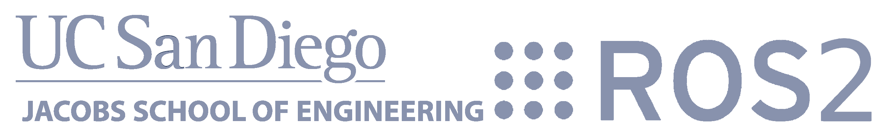

# UCSD ECEMAE148 Team2 FinalProject

<h3>This is the github repo for Team2, we mainly focused on recovering Ublox GPS in ROS2. </h3>
<body>
  In the original github repository from <a href="https://gitlab.com/ucsd_robocar2/ucsd_robocar_hub2">ucsd_robocar_hub2</a>, but it dosen't have the functionality of running gps inside the docker container(ROS2). Therefore, we implemented the node for ublox gps from scratch to work with the existing files for the robot to follow gps coordinates. It would be useful for future classes.
</body>
